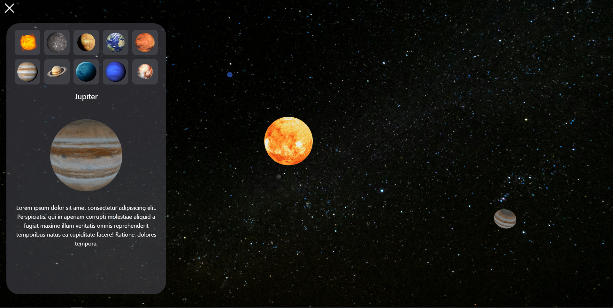

# Planets 3D or Solar System in 3D + ThreeJs

This is a simple "art" about Solar System in 3D. This art is scaled to **1:1000000000**. In this version Solar System are 9 planets (Mercury, Venus, Earth, Mars, Jupiter, Saturn, Uranus, Neptune and Pluto) and sun.

Useful packages:
 - [@react-three/drei](https://www.npmjs.com/package/@react-three/drei/v/9.0.1)
 - [@react-three/fiber](https://docs.pmnd.rs/react-three-fiber/getting-started/introduction)
 - [three](https://www.npmjs.com/package/three)
 - [tailwindcss](https://tailwindcss.com/)

Useful websites:
 - [cgtrader](https://www.cgtrader.com/free-3d-models) free 3d models
 - [three.js](https://threejs.org/docs/) documentation
 - [pmndrs](https://docs.pmnd.rs/) documentation about React Three Fiber and React Three Drei

## Images demo



# React + TypeScript + Vite

This template provides a minimal setup to get React working in Vite with HMR and some ESLint rules.

Currently, two official plugins are available:

- [@vitejs/plugin-react](https://github.com/vitejs/vite-plugin-react/blob/main/packages/plugin-react/README.md) uses [Babel](https://babeljs.io/) for Fast Refresh
- [@vitejs/plugin-react-swc](https://github.com/vitejs/vite-plugin-react-swc) uses [SWC](https://swc.rs/) for Fast Refresh

## Expanding the ESLint configuration

If you are developing a production application, we recommend updating the configuration to enable type aware lint rules:

- Configure the top-level `parserOptions` property like this:

```js
export default {
  // other rules...
  parserOptions: {
    ecmaVersion: 'latest',
    sourceType: 'module',
    project: ['./tsconfig.json', './tsconfig.node.json'],
    tsconfigRootDir: __dirname,
  },
}
```

- Replace `plugin:@typescript-eslint/recommended` to `plugin:@typescript-eslint/recommended-type-checked` or `plugin:@typescript-eslint/strict-type-checked`
- Optionally add `plugin:@typescript-eslint/stylistic-type-checked`
- Install [eslint-plugin-react](https://github.com/jsx-eslint/eslint-plugin-react) and add `plugin:react/recommended` & `plugin:react/jsx-runtime` to the `extends` list
